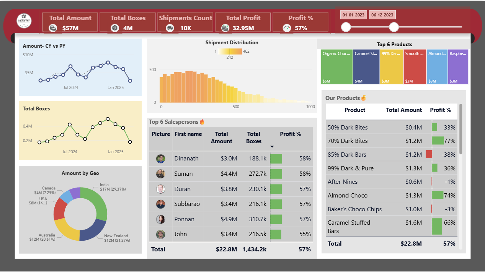

# power-bi-chocolate-sales-dashboard
📊 Chocolate Sales Dashboard (Power BI) – Interactive dashboard analyzing $57M revenue, 4M boxes, and 10K shipments. Includes sales trends, top products, geo insights, and salesperson performance using DAX &amp; Power Query.

## 📊 Project Overview
This Power BI Chocolate Sales Dashboard provides a comprehensive analysis of sales performance, profit, and shipment data.

## 🚀 Key Metrics
- Total Revenue: $141M
- Total Boxes Sold: 9M
- Shipments: 25K
- Total Profit: $81.1M
- Profit Percentage: 57%

## 🔍 Dashboard Features
- Sales Trend Analysis (CY vs PY)
- Shipment Distribution Insights
- Top Performing Products
- Salesperson Performance Analysis
- Region-wise Sales Distribution
- Product-wise Profit Analysis

## 🛠️ Tools & Technologies
- Power BI
- DAX
- Power Query
- Excel / SQL (for data source)

## 📈 Key Insights
- Identified top 6 products contributing highest revenue
- Tracked sales growth over time
- Compared regional performance (USA, UK, India, etc.)
- Evaluated salesperson efficiency based on profit %

## 📁 Files Included
- Power BI Dashboard Project.pbix
- Dashboard.png (Preview Image)
